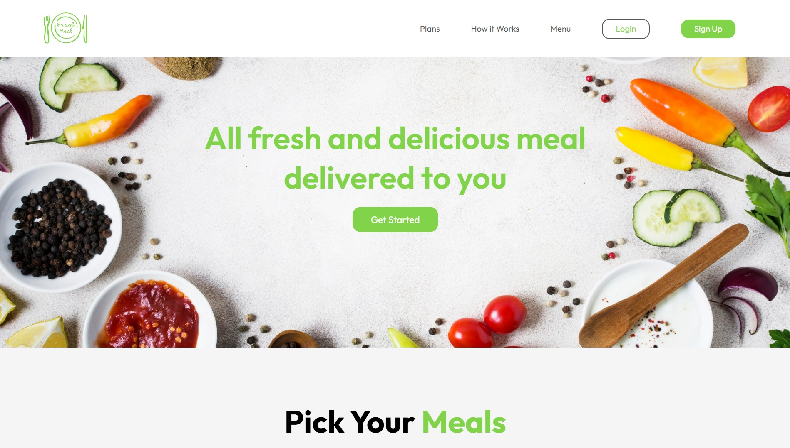
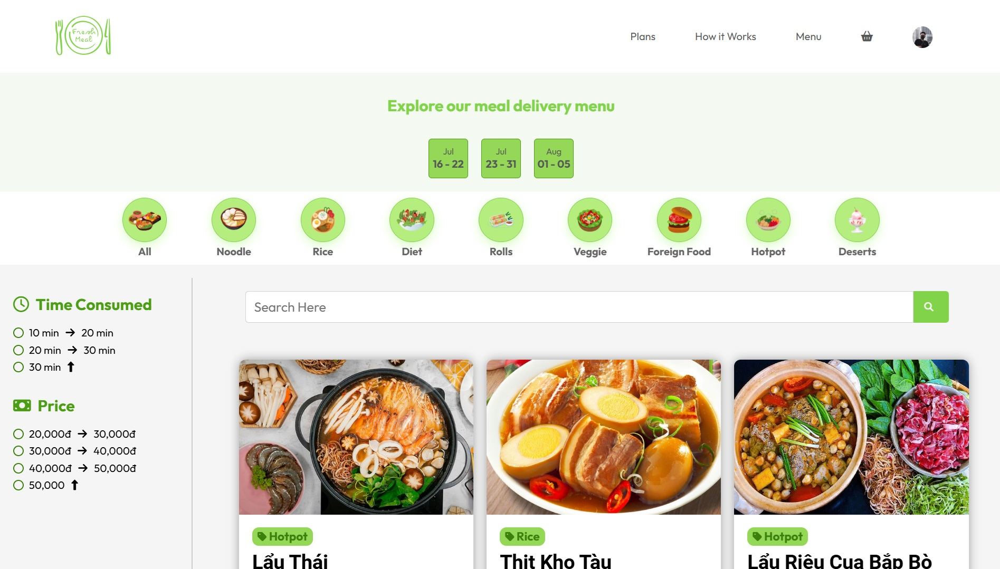
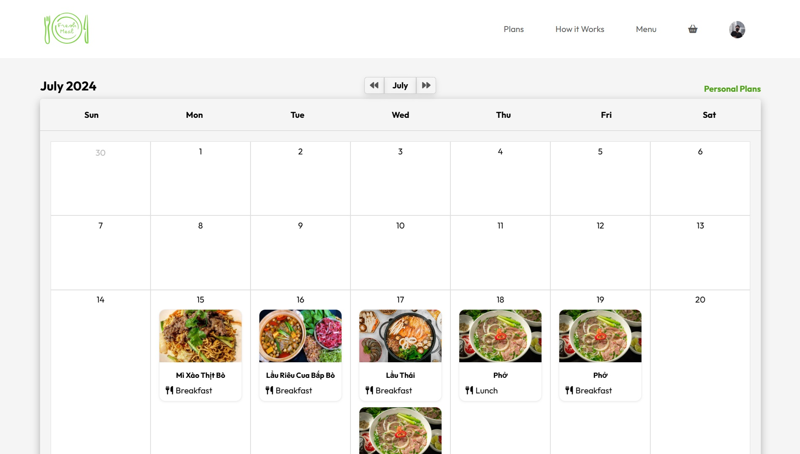
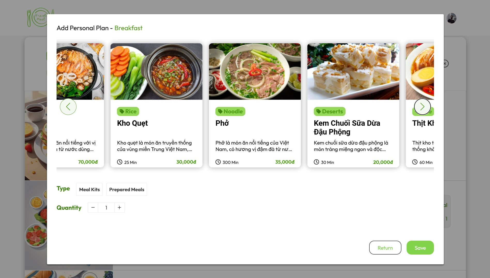
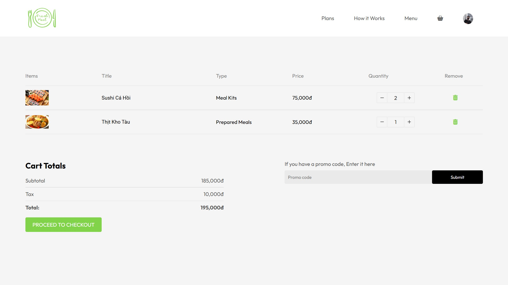
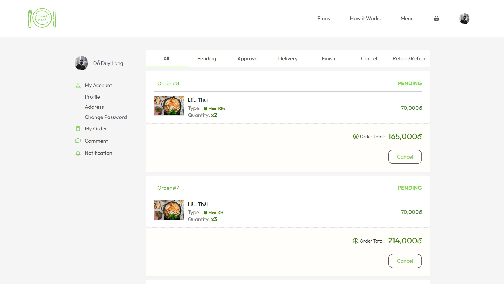
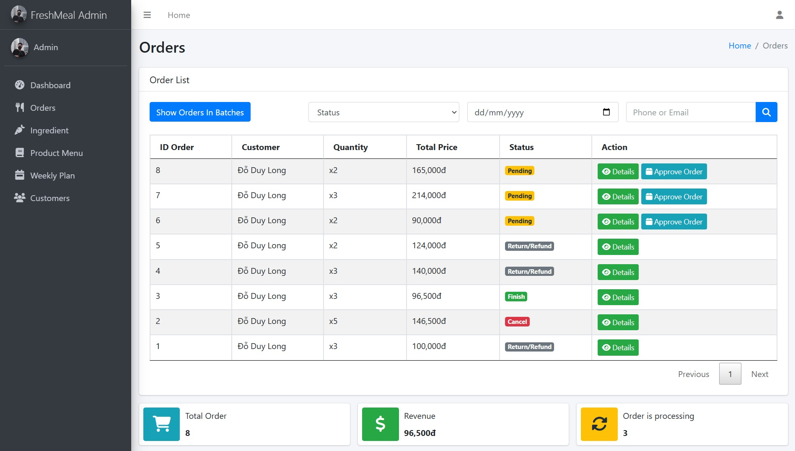
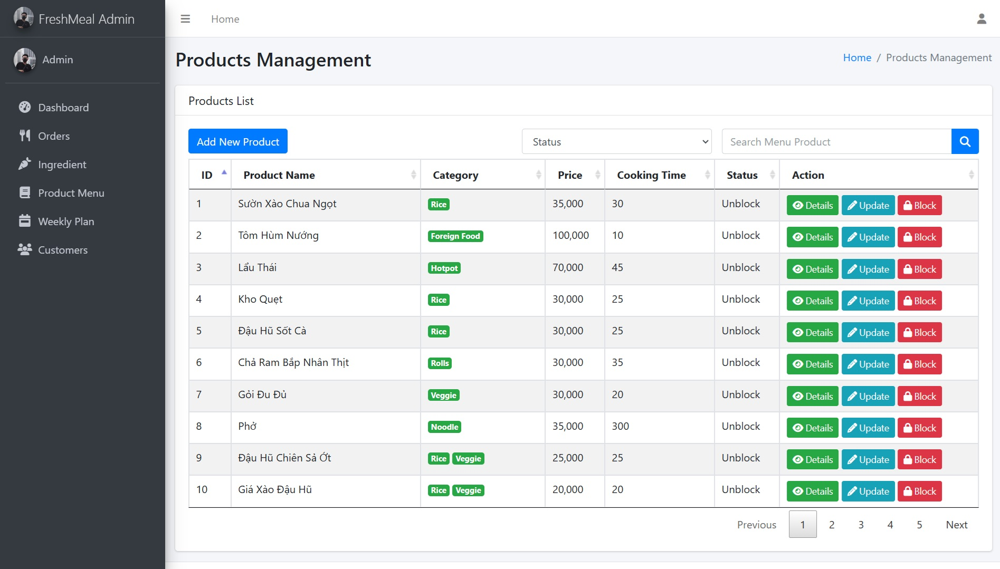

# FRESHMEAL - Healthy Meal Planning & Delivery System

## 📋 Overview

FRESHMEAL is a web-based application designed to help busy urban professionals plan and maintain healthy eating habits. The system offers meal planning, ordering, and delivery services, making it easier for users to access healthy, fresh food despite their busy schedules.

## 🎯 Problem Statement

Urban professionals face several challenges in maintaining healthy eating habits:

- Limited time for meal planning and cooking
- Difficulty accessing fresh ingredients during convenient hours
- Challenges in creating balanced, healthy meal plans
- Distance from food markets and shopping centers

## 💡 Solution

FRESHMEAL provides a comprehensive platform that enables users to:

- Access weekly menus with detailed recipes
- Create personalized meal plans
- Order pre-planned meals
- Track order history
- Accommodate special dietary requirements (vegetarian, vegan, etc.)

## 🛠️ Technical Stack

- **Frontend**: JSP, HTML, CSS, JavaScript
- **Backend**: Java Servlets
- **Architecture**: MVC2 Pattern
- **Database**: SQL Server

## 🔑 Key Features

### Customer Features

1. **Weekly Menu Management**

   - View weekly menus with detailed recipes
   - Access specialized dietary options (vegetarian, vegan)
   - Search functionality for menus

2. **Personal Meal Planning**

   - Create custom meal plans (1-4 weeks)
   - Edit and delete meal plans
   - Add system meals to personal plans
   - Monday to Saturday planning capability

3. **Order Management**

   - Place meal orders
   - View order history
   - Track order status

4. **User Authentication**
   - User registration
   - Secure login system
   - Profile management

### Staff Features

1. **Order Management**

   - Process orders in batches
   - Group orders by delivery address
   - Search orders by date and customer contact

2. **Administrative Controls**
   - Menu management
   - User management
   - Order tracking and updates

## 🏗️ System Architecture

The application follows the MVC2 architecture:

- **Model**: Business logic and data management
- **View**: JSP pages for user interface
- **Controller**: Servlets for request handling
- **Filters**: Request/Response preprocessing (optional enhancement)

## 📸 Main Interface & Features

### 1. Home Page



### 2. Weekly Menu Interface



### 3. Personal Meal Planning





### 4. Order System





### 5. Admin Order Management



### 6. Admin Menu Management



## 📝 Development Guidelines

### Code Structure

```
src/
├── main/
│   ├── java/
│   │   ├── controllers/
│   │   ├── models/
│   │   ├── dao/
│   │   ├── utils/
│   │   └── filters/
│   ├── webapp/
│   │   ├── WEB-INF/
│   │   ├── views/
│   │   ├── assets/
│   │   └── index.jsp
│   └── resources/
└── test/
```

## 🚀 Getting Started

### Prerequisites

- JDK 1.8
- Apache Tomcat 8.0.27.0
- SQL Server

### Installation Steps

1. Clone the repository:
   ```bash
   git clone https://github.com/ShyNing76/FreshMeal-Official.git
   ```
2. Configure database settings in `config.properties`
3. Build the project:
   ```bash
   mvn clean install
   ```
4. Deploy to Tomcat server

### Running the Application

1. Start the Tomcat server
2. Access the application at `http://localhost:8084/F.R.E.S.H_Meal/`

## 👥 Contributors

- [Đỗ Duy Long](https://github.com/ShyNing76)
- [Trần Nguyễn Việt Quang](https://github.com/DavidQuang-dev)

## 📞 Support

For support, please contact [FreshMeal](freshmeal05072004@gmail.com)

---

<div align="center">
  Made with ❤️ by the FreshMeal Team
</div>
